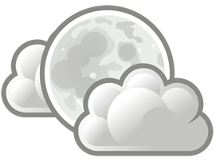

{.right}
Saturn has a prominent ring system that consists of nine continuous main rings and three discontinuous arcs, composed mostly afn of ice particles with a smaller amount of rocky debris and dust.